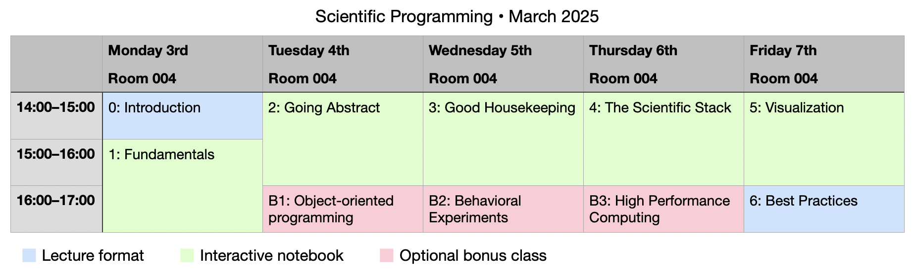

# Scientific Programming: A Crash Course

Welcome to this course on Scientific Programming. My name is [Jon Carr](https://joncarr.net). I am currently working as a software developer, but I used to be a postdoc in Davide Crepaldi’s lab at SISSA. I will be your guide to programming over this week-long course. I look forward to meeting you all soon!

This is a one-week intensive course, which will run daily **14:00–17:00 from Monday 3rd to Friday 7th March 2025**. Although I will do a little bit of lecturing, the course will mostly be very interactive with lots of practical exercises and independent working. It is therefore important that **you bring a laptop computer with you**.

The class with take place in **Room 004** on the ground floor. Before attending the first class, please try to get your computer set up with the relevant software (see below).

The final lecture on best practices in scientific programming is open to anyone at SISSA, even if you didn’t follow the main course. This will be on Friday 7th at 16:00.


## General information

Scientists with no formal training in computer science (which includes myself) face two common problems. First, we typically learn programming by trial-and-error; someone gives us some code and then we randomly change things until it works – I’m sure you’ve all had this experience before! Although this may work when you’re first getting started, it is not a good general solution. My first goal in this course is to help you develop a solid grasp of the core concepts in programming; things like variables, loops, and functions. A good understanding of these basics is essential for writing your own code with confidence.

The second problem we often face when starting out is that we cannot see the entire landscape of options available to us, and, as a result, we can get stuck in narrow, suboptimal patterns. Therefore, my second goal in this course is to give you a broader, conceptual view of programming, especially as it relates to typical scientific pipelines (data management, experimental design, computational modeling, etc.). Memorizing the syntax of a particular language is not the main goal of this course; rather, I want you to understand general concepts like abstraction and control structure, I want to highlight the wide array of tools available to you, and I want to draw your attention to good practices, such as organizing, documenting, and testing your code. Overall, I want to help you feel confident exploring programming for yourself.

In this course we’ll be using Python, which is a nice general-purpose programming language. The language is pretty friendly, which makes it relatively easy to get started and learn the basic concepts. However, even if you choose not to stick with the Python language in the future, the concepts you learn should be broadly applicable to other languages too.


## Who is this course for?

### Beginner programmers

Beginners will probably get the most out of this course, but they may also struggle to keep up – there’s so much to learn and so little time! However, if you ever feel a bit overwhelmed, please do not worry – just follow the course at your own pace. It’s perfectly okay to revisit previous topics when you get confused. I would much prefer that you understand things clearly than rush ahead to the end of the course without a solid understanding. Above all, remember that this is a judgement-free zone, and there are no stupid questions. If you are stuck on something, then probably other people are stuck on the same thing, so don’t hesitate to ask questions and talk to the people around you.

### Intermediate programmers

If you already have some programming experience, you can still take part in this course. I hope you will find it to be a good opportunity to review the core concepts and perhaps pick up a few new tips and tricks along the way. I would still recommend that you follow all the material step by step. Even though the concepts may be familiar, you will likely discover lots of little details that you didn’t notice before. If you’re able to get through the material quite quickly, please feel free to ask me more general questions or for advice about your own projects. I certainly don’t know everything, but I’ll try my best!

### Advanced programmers

If you’re an advanced programmer, then this is probably not the right course for you. Nevertheless, you may enjoy the final lecture on Friday where I will talk about good coding practices in science.


## Syllabus

Most of the course follows an interactive notebook format. Each day you download the “notebook” file and then you can work through it step by step, running the code snippets for yourself. While you work through the notebook, I will be available to help... just wave your hand to get my attention. We will also have a little bit of group discussion during the classes.

Except for the optional bonus units (shown in red below), you should *not* skip any of the notebooks; each one is designed to follow on from the previous ones and assumes knowledge from the prior material. Over the week, I may adapt the course a little depending on your collective needs and interests; however, here’s an overview of what I aim to cover in each unit:



### 1. Fundamentals

This class will cover the basics of programming, including core data types (numbers, strings, lists, etc...), loops, and conditional structures. In principle, you can compute anything with these core components, although not very effectively or efficiently.

### 2. Going Abstract

In this unit we will learn how to program more effectively by taking advantage of functions. Optionally, you can also stick around for the bonus unit on object-oriented programming, which covers more advanced types of abstraction.

### 3. Good Housekeeping

Here we will cover some important – but slightly more general – concepts: Reading and writing data, file paths, handling errors, organization, and working with the terminal.

### 4. The Scientific Stack

In this unit, I will introduce some common packages that are widely used in the scientific community: NumPy (for numerical computation), Pandas (for handing and manipulating datasets), and Scipy (which provides various scientific functions). We’ll also construct a simple simulation to answer a math problem.

### 5. Visualization

In the last module, we will look at how to produce attractive and informative visualizations of data and some basic statistics.

### 6. Best practices

In this final lecture, I will speak on the theme of good practices in scientific programming. This lecture is open to anyone at SISSA, even if you didn’t follow the main course. Topics will include:

- Open-source
- Open-access
- Reproducibility
- Version control
- Virtual environments
- Documentation
- Code review
- Style and code formatting
- Unit testing and coverage


## Bonus units

I would like everyone to pick at least one bonus class to follow, but feel free to attend as many as you like depending on your interests. You can also use this time to continue working on the main notebooks if you prefer.

### B1. Object-oriented programming

This notebook will introduce you to object-oriented programming, a style of programming in which you define “objects” depending on your particular domain of interest. For example, a molecular biologist might want to define different molecule ”objects” and then study how they interact. This class is probably more suitable for intermediate programmers who want to develop their understanding in this area.

### B2. Behavioral experiments

In this module we will code up a basic behavioral experiment using PsychoPy (for lab experiments) and jsPsych (for online experiments). This unit should be especially relevant to people in Cognitive Neuroscience, where running experiments with human participants is very common.

### B3. High Performance Computing

In this class, I will give you some tips on how to scale up your code for high-performance applications. We will look at strategies for optimizing your code and running code in parallel on SISSA’s high performance computer cluster, Ulysses. This class should be interesting to people doing various kinds of computational modelling.


## Software Installation

Before attending the first class, please try to get your computer set up with a working Python installation and the Jupyter Notebook package. Sometimes it can be tricky to get things set up correctly, but I will be available to help you during the first class in case of any problems.

The easiest way to install everything is to use Anaconda: https://www.anaconda.com/download This is a special distribution of Python that includes many of the packages we will need, including Jupyter Notebook. When you click the link above, it asks for an email address, but you can just click the "Skip registration" link. Then, download and install the Anaconda Distribution for your platform. It is also possible to install Miniconda instead, but this will require you to install the packages manually, so it's usually easier to install the main Anaconda distribution.

### Alternative installation options

The Anaconda distribution is quite large, so if you prefer to be more minimalist, another alternative option is to install the official "vanilla" version of Python: https://www.python.org However, I would only recommend this option if you are reasonably familiar with the command line. Once Python is installed, you will then need to install the required packages by running this command:

```bash
pip install -r requirements.txt
```

Once everything has finished installing, you should be able to launch Jupyter Notebook like this:

```bash
jupyter notebook
```

If you use Linux or Mac, Python is installed by default as part of the operating system, so it‘s also possible to use that version of Python directly. Alternatively, you may already have a Python installation from previous projects you’ve worked on.

If you go down the route of installing Python manually (rather than using Anaconda), I would suggest you first create a new virtual environment, so that the packages you install do not conflict with other stuff you might be doing:

```bash
mkdir sciprog23
cd sciprog23
python3 -m venv venv
source venv/bin/activate
pip install -r requirements.txt
jupyter notebook
```

If this looks a bit scary, don’t worry, I can help in class.

### Last resort: Web version

Finally, if you encounter major issues getting stuff installed, you can also use the web version of Jupyter Notebook from here: https://jupyter.org/try This is not a good long-term solution, but you will at least be able to follow along with the course.
